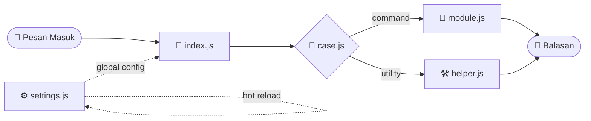

<!-- ═══════════════════════ HEADER ═══════════════════════ -->
<div align="center">


<a href="https://github.com/Vinss-Store/Vinss-MultiDevice">
  
</a>

<br/><br/>


<br/>

<a href="https://www.youtube.com/@VinssBotz"></a>
<a href="https://whatsapp.com/channel/0029VaF4IIt1CYoaRgoOaX2i"></a>
<a href="https://www.vinss.biz.id/"></a>

</div>


## 📖 Tentang

**Vinss MD** adalah base bot WhatsApp multi-device berbasis **[Baileys](https://github.com/WhiskeySockets/Baileys)** yang ditulis dengan **ES Modules**. Cocok buat kamu yang mau mulai bikin bot tanpa pusing bikin fondasinya dari nol.

| | |
|:---|:---|
| 🎬 **Recode by** | Vinss Students |
| 👑 **Base original** | Zass Desuta |
| 📅 **Rilis** | Base Bot WhatsApp Terbaru 2026 |
| 📜 **Lisensi** | MIT |


## ✨ Fitur

<div align="center">

| 🔑 Pairing Code | 🔥 Hot Reload | 👋 Welcome & Leave | 📵 Anticall |
|:---:|:---:|:---:|:---:|
| Login pakai nomor + kode pairing kustom, tanpa scan QR | `settings.js` otomatis dimuat ulang saat diubah | Sambut atau lepas member grup otomatis | Tolak panggilan masuk otomatis |

| 📢 JPM & Push Kontak | 👁️ Auto Read | 🌐 Public / Self | 🖼️ Media & Sticker |
|:---:|:---:|:---:|:---:|
| Broadcast dengan delay bisa diatur | Baca chat & status otomatis | Ganti mode bot dengan satu flag | Sticker, canvas, konversi audio/video |

</div>


## 🗂️ Struktur Proyek

```text
Vinss-MultiDevice/
├── 📁 lib/              # library internal
├── 🚪 index.js          # entry point
├── 🧠 case.js           # logika command
├── 🧩 module.js         # module tambahan
├── 🛠️ helper.js         # fungsi utility
├── ⚙️ settings.js       # konfigurasi bot (buat dari settings.js.bak)
├── 📄 settings.js.bak   # template konfigurasi
├── 📋 package.json
└── 📜 LICENSE
```

### 🔄 Alur Kerja




## 🚀 Instalasi

### Prasyarat

- **Node.js 20+** (disarankan versi LTS terbaru)
- **Git**
- Nomor WhatsApp khusus untuk bot

### Langkah-langkah

```bash
# 1. Clone
git clone https://github.com/Vinss-Store/Vinss-MultiDevice.git
cd Vinss-MultiDevice

# 2. Install dependencies
npm install

# 3. Buat file konfigurasi dari template
cp settings.js.bak settings.js

# 4. Jalankan
npm start
```

> [!TIP]
> Kalau `settings.js` sudah ada di repo, langkah 3 bisa dilewati. Cukup edit isinya.

### 🔑 Login dengan Pairing Code

Bot ini memakai nomor bot (`nomorbot`) dan kode pairing kustom (`pair`), jadi login-nya tanpa scan QR:

1. Jalankan `npm start`, kode pairing akan muncul di terminal.
2. Di HP bot, buka **WhatsApp → Perangkat Tertaut → Tautkan Perangkat**.
3. Pilih **Tautkan dengan nomor telepon saja**, lalu masukkan kodenya.

> [!NOTE]
> Kode pairing WhatsApp panjangnya 8 karakter, dan `VINSSBOT` di template pas 8 huruf. Kalau kamu ganti, pastikan tetap 8 karakter.


## ⚙️ Konfigurasi (`settings.js`)

Semua pengaturan disimpan sebagai variabel `global` di `settings.js`.

```js
// ── Owner ──
global.ownernumber = '62xxxxxxxxxxx'   // nomor owner (wajib restart setelah diubah)
global.ownername   = 'NAMA OWNER'

// ── Bot ──
global.namabot  = 'NAMA BOT'
global.nomorbot = '62xxxxxxxxxxx'      // nomor yang dipakai bot
global.pair     = 'VINSSBOT'           // kode pairing kustom (8 karakter)
global.botMode  = true                 // true = public, false = self
```

| Kategori | Variabel | Fungsi |
|:---|:---|:---|
| 👤 Owner | `ownernumber`, `lidownernumber`, `ownername` | Identitas owner bot |
| 🤖 Bot | `namabot`, `nomorbot`, `pair`, `version` | Identitas & login bot |
| 🔀 Mode | `botMode` | `true` public, `false` self |
| ⌨️ Prefix | `prefix` | Daftar karakter prefix command |
| 🎛️ Toggle | `welcome`, `leave`, `autojoingc`, `anticall`, `autoread`, `autoreadsw` | Aktif/nonaktifkan fitur otomatis |
| 🌐 Sosmed | `web`, `linkSaluran`, `idSaluran`, `nameSaluran` | Link website & saluran |
| 🏷️ Watermark | `packname`, `author`, `foother` | Watermark sticker & footer |
| 🖼️ Media | `img`, `thumb`, `thumbxm`, `thumbbc`, `favicon` | Gambar bawaan bot |
| 📢 Broadcast | `delayJpm`, `delayPushkontak`, `namakontak` | Delay (ms) & nama kontak |
| 💬 Pesan | `mess.*` | Teks balasan standar (success, wait, admin, dll.) |
| ⏱️ Interval | `closeMsgInterval`, `backMsgInterval` | Interval pesan (menit / jam) |

> [!IMPORTANT]
> Jangan commit nomor pribadi, token, atau kredensial ke repo publik. Simpan `settings.js` dan folder session di `.gitignore`.


## 🧰 Tech Stack

<div align="center">


</div>

<details>
<summary><b>📦 Lihat semua dependencies</b></summary>

<br/>

| Kategori | Package |
|:---|:---|
| 💬 WhatsApp | `@whiskeysockets/baileys` `7.0.0-rc14`, `@ryuu-reinzz/luna-lib`, `awesome-phonenumber` |
| 🌐 HTTP & Scraping | `axios`, `node-fetch`, `cheerio`, `form-data`, `cloudku-uploader` |
| 🎞️ Media | `@ffmpeg-installer/ffmpeg`, `fluent-ffmpeg`, `node-webpmux`, `node-canvas`, `node-html-to-image`, `file-type` |
| 🗄️ Database & Cache | `mongoose`, `lowdb`, `node-cache` |
| 🧪 Utility | `lodash`, `fs-extra`, `moment-timezone`, `parse-ms`, `yargs`, `pino` |
| 🎨 Tampilan Terminal | `chalk`, `figlet`, `gradient-string` |
| 🛠️ Dev | `depcheck` |

</details>


## 🧩 Cara Nambah Fitur

1. Buka **`case.js`** dan tambahkan command baru di sana.
2. Taruh fungsi bantu di **`helper.js`** atau **`lib/`** kalau dipakai berulang.
3. Simpan. `settings.js` ter-reload otomatis, sedangkan file lain cukup restart bot.

```js
// contoh pola command sederhana di case.js
case 'ping': {
  await reply('Pong! 🏓')
}
break
```

> [!NOTE]
> Contoh di atas hanya ilustrasi pola `case`. Sesuaikan nama variabel (`reply`, dll.) dengan yang dipakai di `case.js` kamu.


## 🤝 Kontribusi

1. 🍴 Fork repo ini
2. 🌿 `git checkout -b fitur-keren`
3. 💾 `git commit -m "Tambah fitur keren"`
4. 🚀 `git push origin fitur-keren`
5. 🔀 Buka Pull Request

## 👑 Kredit

<div align="center">

| Peran | Nama |
|:---:|:---:|
| 🎬 Recode | **Vinss Students** |
| 👑 Base Original | **Zass Desuta** |
| 📚 Library | **Baileys** (WhiskeySockets) & seluruh kontributor open source |

</div>

## 📜 Lisensi

Dirilis di bawah **[MIT License](LICENSE)**. Copyright © 2026 Zass Desuta, Record By Vinss Students.

> [!WARNING]
> Gunakan bot dengan bijak. Bot ini bukan produk resmi WhatsApp, dan penggunaan otomatisasi (terutama broadcast/JPM dan push kontak) bisa membuat nomor dibatasi atau diblokir. Segala risiko ditanggung pengguna. Jangan dipakai untuk spam atau pelanggaran aturan WhatsApp.

<!-- ═══════════════════════ FOOTER ═══════════════════════ -->
<div align="center">


</div>
